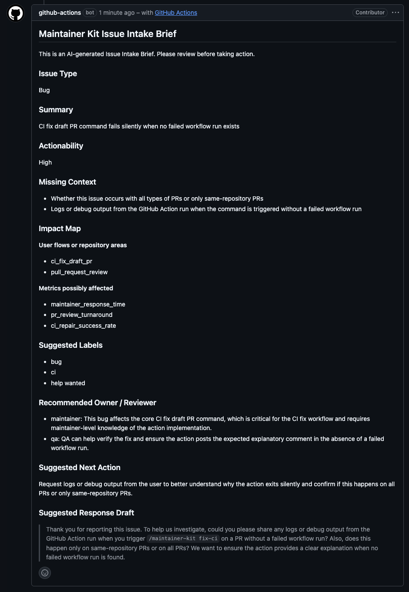
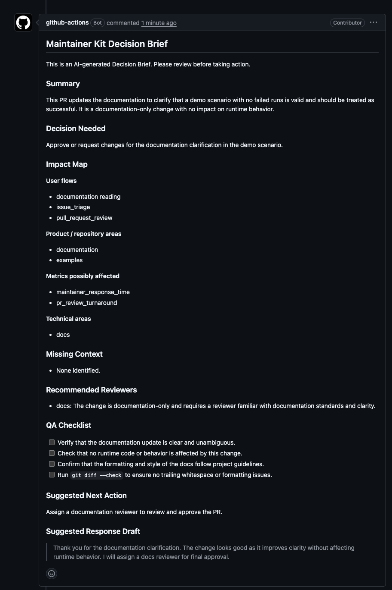
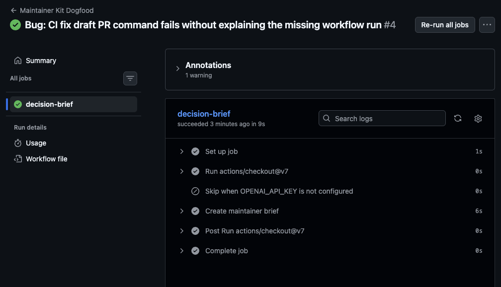

# maintainer-kit demo

This page gives reviewers and early adopters a fast way to understand what `maintainer-kit` does.

`maintainer-kit` is not a generic AI reviewer. It is a maintainer workflow layer for converting
messy Issues, PR diffs, and failed CI context into structured decisions that humans can approve,
reject, or follow up on.

## 30-second story

A maintainer receives an Issue or PR that is directionally useful but not ready to act on.
`maintainer-kit` reads the GitHub context, applies the repository’s `.maintainer-kit.yml`, redacts
sensitive content, truncates oversized diffs/logs, and posts a stable Markdown brief.

The brief is designed to answer:

- What decision is needed?
- What context is missing?
- What repository areas might be affected?
- What QA or release checks are needed?
- What should the maintainer ask or do next?

## Live screenshots

These screenshots show `maintainer-kit` running in this repository as a dogfood workflow.

### Issue Intake Brief

The Issue Intake Brief turns an incomplete Issue into a maintainer-oriented summary: issue type, actionability, missing context, affected areas, and suggested next action.



### PR Decision Brief

The PR Decision Brief turns a Pull Request into a decision-focused review aid: summary, decision needed, impact map, QA checklist, and release-risk notes.



### Workflow run

The workflow run shows the GitHub Actions dogfood path used to generate the public maintainer briefs.



## Demo scenarios

### Issue intake brief

Use this scenario to test the `issues.opened` flow:

```md
Title: Bug: CI fix draft PR command fails without explaining the missing workflow run

When I comment `/maintainer-kit fix-ci` on a PR that does not have a failed workflow run yet, the
action exits without a clear maintainer-facing explanation.

Expected:
The action should post a short comment explaining that no failed pull_request workflow run was
found.

Actual:
The command appears to do nothing.

Context:

- Same-repository PR
- `ci_fix_pr` enabled
- No failed workflow run exists yet
```

This is a synthetic Issue for demonstrating intake and missing-context detection. CI-fix draft PR
execution is not enabled in this repository.

The resulting brief should identify the requested behavior, call out missing reproduction and log
details, map the likely workflow and GitHub integration areas, and suggest a maintainer response.

### Pull Request decision brief

Use this scenario to test the `pull_request.opened` flow:

```md
Title: Add a fallback comment when no failed CI run is available

Summary:

- detect when a trusted fix-ci request has no failed pull_request workflow run
- post a short maintainer-facing explanation
- add tests for the no-run path

Open question:
Should the fallback comment be updated on later retries, or should each command create a new
comment?
```

The resulting brief should frame the comment-update decision, identify affected workflow and
comment-publishing code, and propose QA checks without approving the PR.

## What to capture

For a public demo, capture:

1. the synthetic Issue or PR before the action runs
2. the generated brief comment
3. the relevant `.maintainer-kit.yml` sections
4. the workflow run showing redaction and truncation metadata without sensitive content

Do not include API keys, tokens, private repository content, or unredacted logs in screenshots.

## Safety posture

- Issue and PR brief generation may post or update comments.
- Mutating agent features remain disabled by default.
- Reproduction draft PRs require an explicitly enabled feature and a trusted maintainer trigger.
- `maintainer-kit` does not merge PRs, close Issues, or apply labels automatically.